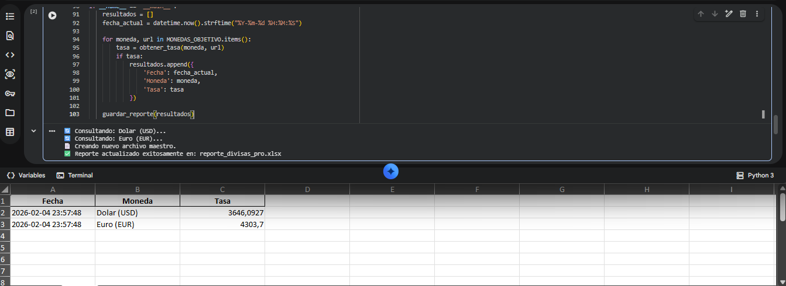

# 🤖 Financial Rates Auditor (Monitor de Divisas Automatizado)

Este proyecto soluciona un problema crítico en departamentos financieros y entornos **SAP**: la actualización manual y propensa a errores de las tasas de cambio (TRM).

## 🎯 El Valor del Proyecto
En lugar de que un consultor busque manualmente el valor del dólar y el euro cada día, este **Bot de Extracción** automatiza el proceso, garantizando que la información sea capturada directamente de fuentes oficiales y consolidada en un historial listo para auditoría.

## 🛠️ Capacidades Técnicas
El motor desarrollado en Python (`Financial_Rates_Bot.ipynb`) implementa:

* **Web Scraping Robusto:** Uso de `BeautifulSoup` y `Requests` para navegar y extraer datos en tiempo real de Google Finance.
* **Gestión Escalable:** Configuración de diccionarios que permiten añadir nuevas divisas (Yen, Libra, etc.) con solo una línea de código.
* **Data Maestro:** Generación y actualización automática de un historial consolidado en Excel (`reporte_divisas_pro.xlsx`), evitando la duplicidad de registros.

## 📊 Impacto en el Proceso Contable
* **Ahorro de Tiempo:** Reducción del 100% en el tiempo de captura manual de TRM.
* **Precisión:** Eliminación del error humano en la digitación de tasas de cambio.
* **Auditoría:** Registro con marca de tiempo (Timestamp) exacta de cada captura para trazabilidad total.

---
*Este proyecto demuestra habilidades en automatización de procesos (RPA), scraping de datos y gestión de archivos maestros financieros.*
